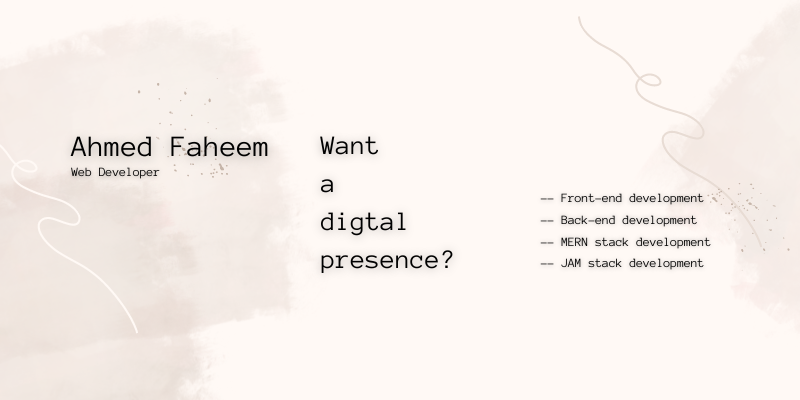
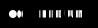

# Hi, Folks! 

It's Ahmed Faheem here. I code 🧑‍💻 to survive. I'm always curious 🧐 to know what's coming next in the tech world. I love️ to convert my thoughts to code so people 👨‍👨‍👧‍👦 can interact with.

When I'm not developing or coding, you can find me watching Netflix 🍿 or listening to music 🎵. Memes 🤣 are something I'm obsessed with.

 
 

<h2>Here are some of my recet article on medium</h2>
<a target="_blank" href="https://github-readme-medium-recent-article.vercel.app/medium/@imantumorang/0">

<h2>Support me on:</h2>

<h2>Follow me on:</h2>
  
  &nbsp;&nbsp;&nbsp;&nbsp;
  
  &nbsp;&nbsp;&nbsp;&nbsp;
  
  &nbsp;&nbsp;&nbsp;&nbsp;
  
  &nbsp;&nbsp;&nbsp;&nbsp;
  
    &nbsp;&nbsp;&nbsp;&nbsp;
  

